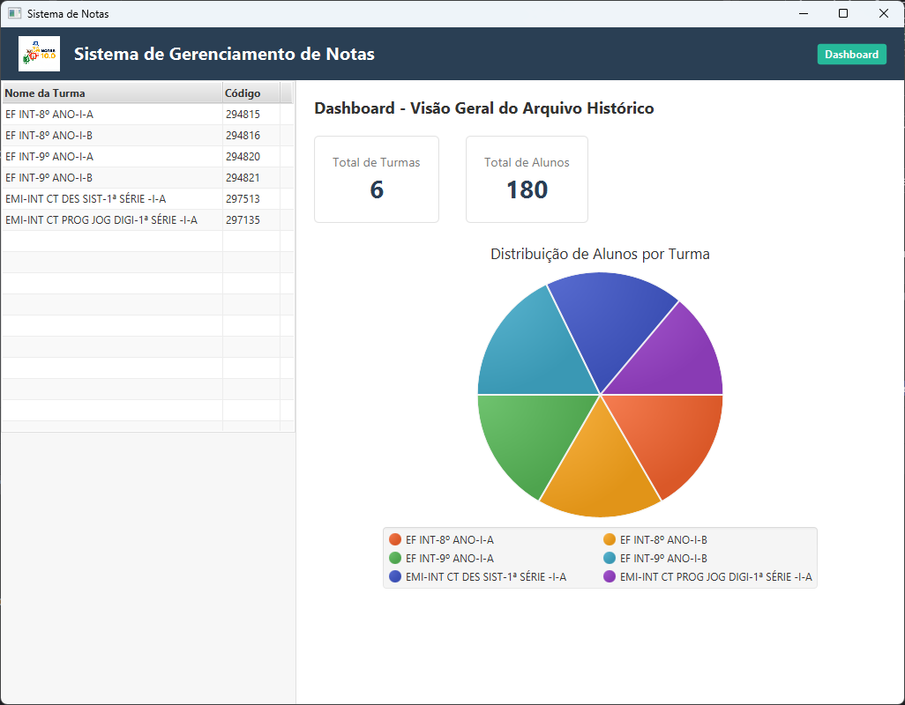

# Notas - Sistema de Gerenciamento de Notas

## Visão Geral

**Notas** é uma aplicação Java de desktop para auxiliar professores no gerenciamento de notas de alunos. O sistema foi projetado para carregar dados de arquivos JSON e CSV, centralizar a lógica de negócio e servir como um backend robusto para uma futura interface gráfica (GUI).

A aplicação conta com uma ferramenta de linha de comando para importar dados de planilhas (em formato `.csv`) e convertê-los para o formato JSON utilizado pelo sistema.

---

## Screenshot da Aplicação



---

## Documentação Detalhada

Para mais informações sobre a arquitetura e o uso da aplicação, consulte os seguintes documentos:

- **[Como Usar a Aplicação](docs/COMO_USAR.md)**: Um guia passo a passo sobre como importar notas e executar a aplicação.
- **[Arquitetura de Persistência](docs/PERSISTENCIA.md)**: Uma explicação de como os dados são salvos em arquivos JSON.
- **[Backup e Sincronização com Banco de Dados](docs/BACKUP_E_SINCRONIZACAO.md)**: Detalhes sobre a arquitetura de backup com banco de dados H2.
- **[Interface Gráfica e Componentes](docs/GUI_E_COMPONENTES.md)**: Uma descrição detalhada dos componentes visuais da aplicação JavaFX.
- **[Automação com Scripts PowerShell](docs/SCRIPTS_POWERSHELL.md)**: Um guia sobre as ferramentas de linha de comando para entrada e manutenção de dados.
- **[Ferramentas e Recursos do Backend](docs/FERRAMENTAS_E_RECURSOS.md)**: Um resumo técnico dos principais componentes do sistema.
- **[Configuração do JavaFX e Resolução de Problemas](docs/CONFIGURACAO_JAVAFX.md)**: Detalhes sobre a configuração do ambiente JavaFX e solução de problemas comuns.

---

## Estrutura do Projeto

```
notas_java/
├── data/                           # Contém todos os dados e configurações
│   ├── importar/                   # (1) Coloque os arquivos .csv/.json para importação aqui
│   │   └── processados/            # Arquivos são movidos para cá após o processamento
│   ├── notas_json/                 # (Gerado) Arquivos .json de notas
│   │   └── backup/                 # (Gerado) Backups dos arquivos de notas
│   ├── examples/                   # Contém arquivos JSON de exemplo com dados fictícios
│   ├── backup/                     # (Gerado) Backups das listas de alunos
│   ├── turmas/                     # (Ignorado) Contém os arquivos JSON com as listas de alunos por turma
│   └── turmas-com-disciplinas.json # Arquivo principal com a estrutura de turmas e disciplinas
├── docs/
│   └── ... (Toda a documentação)
├── lib/
│   ├── gson-2.10.1.jar             # Biblioteca externa para manipulação de JSON
│   └── javafx-sdk-25.0.1/          # SDK do JavaFX (exemplo)
├── src/
│   ├── app/                        # Ponto de entrada da aplicação principal (Main.java)
│   ├── dto/                        # Data Transfer Objects e o ImportadorDeNotas
│   ├── gui/                        # Classes da interface gráfica (GUI)
│   ├── model/                      # Classes de domínio (lógica de negócio)
│   ├── service/                    # Classes de serviço (GerenciadorDeDados)
│   └── tools/                      # Ferramentas de linha de comando (FerramentaImportacao)
├── .gitignore                      # Arquivo para ignorar arquivos desnecessários
├── LICENSE                         # Licença do projeto
├── README.md                       # Este arquivo
├── AtualizarNotas.ps1              # Script para entrada de dados em lote
├── AtualizarRecuperacao.ps1        # Script para atualizar apenas notas de recuperação
└── SincronizarAlunos.ps1           # Script para manutenção e sincronização de alunos
```
---

## Como Começar

1

---

## Como Começar

1.  **Clone o Repositório:** `git clone https://github.com/helioprofcaic/notas_java.git`
2.  **Configure o Ambiente:** Certifique-se de que seu IDE (IntelliJ, Eclipse, etc.) está configurado com o JDK correto e com o SDK do JavaFX. Veja o guia Configuração do JavaFX.
3.  **Popule os Dados:**
    - Edite o arquivo `data/turmas-com-disciplinas.json` para refletir suas turmas e disciplinas.
    - Use os scripts PowerShell (`AtualizarNotas.ps1`, etc.) para popular os dados dos alunos e das notas. Consulte o guia de Automação com Scripts PowerShell para mais detalhes.
4.  **Execute a Aplicação:** Execute a classe `app.Main.java`. Ela apresentará um menu no console para você escolher qual ferramenta deseja iniciar (a Interface Gráfica, o Sincronizador com o BD, etc.).

---

## Autor

**Professor Helio Lima**
- **Email:** raimundo.helio@professor.edu.pi.gov.br
